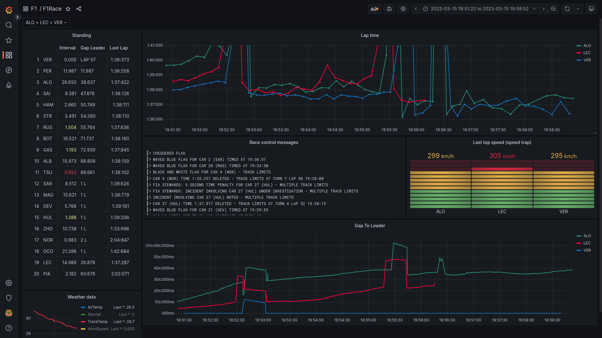

# f1-live-data
You want a better view of the live data of a F1 race? f1-live-data is easy to use and customizable to your needs.

## Requirements
- Docker installed
- python 3.13 (for developing)

## Quick start
Tested on Ubuntu 22.04
```
chmod -R 777 storage/
docker compose up -d
docker build -t data-importer-image .

# if a f1 race is currently under way:
docker run -it --rm \
--network f1-live-data_default \
data-importer-image \
dataimporter process-live-session \
--influx-url http://influxdb:8086

# else
docker run -it --rm \
--network f1-live-data_default \
-v ${PWD}/saves/partial_saved_data_2023_03_05.txt:/tmp/save.txt \
data-importer-image \
dataimporter process-mock-data /tmp/save.txt \
--influx-url http://influxdb:8086

# Browse http://localhost:3000
# admin / admin
# Dashboards > Browse > F1 > F1Race
```

## Run the data-importer locally (for debugging)
```
docker compose up -d
pip install .
dataimporter process-mock-data saves/partial_saved_data_2023_03_05.txt --influx-url http://localhost:8086
```

## Features

- Select only your favorite drivers (top, left)
- Leaderboard with Interval, Gap to Leader, Last Lap Time
- Lap time evolution
- Race control messages
- Top speed at speed trap
- Gap to leader graph
- Weather data


## Data flow
```
┌─────────────┐      ┌────────┐      ┌───────┐
│data-importer├─────►│influxdb│◄─────┤grafana│
└─────────────┘      └────────┘      └───────┘
```
The `data-importer` uses the live timing client from `fastf1` to receive live timing data during a f1 session.
The data is stored in an `influxdb`. `grafana` is used to display the data by querying it from `influxdb`.

The `data-importer` has two modes:
- process-live-session: Processes data from a live session via `fastf1` live timing client.
- process-mock-data: Loads data from file and replays it (with a default speedup factor of 100). This mode can be used to develop new panels and debug it.

## Processed data
`fastf1` provided a bunch of different data points. Not all of them are processed:
```
Processed: WeatherData, RaceControlMessages, TimingData
Not Processed: Heartbeat,CarData.z,Position.z,ExtrapolatedClock,TopThree,RcmSeries,TimingStats,TimingAppData,TrackStatus,DriverList,SessionInfo,SessionData,LapCount
```


## Get a file with live data via fastf1 python package
You can record a live session with the live timing client from `fastf1`
```
python -m fastf1.livetiming save saved_data_2022_03_19.txt
```
The recorded file can be used to develop and test the data processing. 
The data-importer is able to load the recorded file (command `process-mock-data`)

## Tricks

### Add driver color to same panels
To add the color of a driver to a panel via the UI can be annoying. 
There is a command line tool do accomplish that.
Just pass the path of the dashboard and the names of the panels:
```shell
python src/dataimporter/dashboard_utils.py storage/grafana/dashboards/dashboard.json "Lap time" "Gap To Leader"
```

### Edit and persist a grafana dashboard/panel:
1. Edit the panel in the UI
2. Click the save button
3. Click "Copy JSON to clipboard"
4. Replace the content of the file `storage/grafana/dashboards/dashboard.json`

### Set a max value in lap time panel
Laps with pit stops are very slow and lead to a large value range on the y axes.
You can set a maximum value in the panel settings. 

## Known issues
- data-importer disconnects after 2h (the f1 data providing service seems to close the connection, see [fastf1](https://theoehrly.github.io/Fast-F1/livetiming.html?highlight=live#important-notes))

## Further ideas
- Display car position (`Position.z`)
- Display telemetry (`CarData.z`)
- Display (personal) fastest lap
- Display sector times
- Number pit stops and tires compound (`TimingAppData`)
